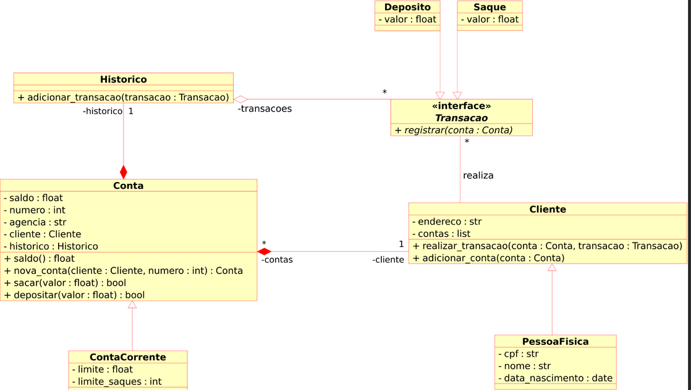

# Resolução do Lab Project: Modelando o Sistema Bancário em POO com Python
## Bootcamp NTT DATA - Engenharia de Dados com Python

### Introdução
O arquivo ***sist_banbancario_3.py*** contém minha solução para o Lab Project: "Modelando o Sistema Bancário em POO com Python" solicitado no Bootcamp NTT DATA - Engenharia de Dados com Python de acordo com suas regras e atualizando a Versão 2 deste arquivo que pode ser consultado em [***sist_bancario_2.py***](https://github.com/EngThiagoFerrari/trilha-python-dio/tree/solucoes_trilha_python/solucoes_python/sist_bancario_2).

### Tecnologia
  

### Regras do Lab Project  
- As regras de Depósito, Saque e Extrato, ainda respeitam a versão 1 e versão 2 deste projeto.

#### Objetivo Geral
- Iniciar a modelagem do sistema Bancário em POO (Programação Orientada a Objetos).
- Adicionar classes para cliente e as operações bancárias: depósito e saque.

#### Desafio
- Atualizar a implementação do sistema bancário, para armazenar os dados de clientes e contas bancárias em objetos ao invés de dicionários. O código de seguir o modelo de classes UML abaixo:

#### Desafio extra
- Após concluir a modelagem das classes e a criação dos métodos. Atualizar os métodos que tratam as opções do menu, para funcionarem com as classes modeladas.

### Melhorias implementadas
- Atendiemnto aos requisitos de ambos os desafios apresentados neste lab, incluindo o funcionamento de todas as opções dos menus da conta através de funções que instanciam com as classes modeladas.

- Limpeza do terminal a cada operação para garantir maior clareza no entendimento das informações exibidas ao usuário.